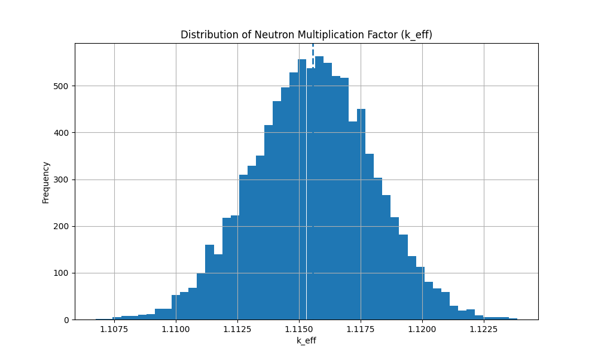

# Monte Carlo Neutron Transport Simulation

A simplified **Monte Carlo neutron transport simulation** written in **C++** that estimates the neutron multiplication factor (**k_eff**) of a reactor-like system using stochastic particle transport.

---

## Overview

In nuclear reactor physics, the **multiplication factor (k_eff)** determines the state of a reactor:

| Reactor State | Condition | Meaning                     |
| ------------- | --------- | --------------------------- |
| Subcritical   | k_eff < 1 | Neutron population dies out |
| Critical      | k_eff = 1 | Steady neutron population   |
| Supercritical | k_eff > 1 | Neutron population grows    |

This simulation models thousands of neutron histories and statistically estimates **k_eff**.

---

## Physics Model Implemented

The simulation includes several key neutron transport physics components:

* Monte Carlo neutron tracking
* Random neutron direction sampling
* Exponential neutron free-flight distance
* Neutron scattering events
* Neutron absorption events
* Neutron-induced fission
* Fission neutron generation (2–3 neutrons)
* Energy reduction during scattering
* Reactor boundary leakage
* Population control for stable k-eigenvalue estimation

---

## Simulation Algorithm

Each simulation run performs the following steps:

1. Initialize neutron population
2. Sample neutron flight distance using exponential distribution
3. Move neutron in 3D space
4. Check reactor boundary leakage
5. Sample interaction type:

   * Scatter
   * Absorption
   * Fission
6. Generate new neutrons for fission events
7. Control population size to maintain statistical stability
8. Compute generation multiplication factor
9. Repeat for many generations

---

## Monte Carlo Experiment

The program runs:

```
10,000 independent simulations
```

Each simulation estimates **k_eff**.

The results are stored in:

```
k_results.csv
```

---

## Statistical Analysis

Python is used to analyze the results and visualize the distribution.

Libraries used:

* NumPy
* Matplotlib

Example statistics from a run:

```
Total simulations: 10000
Mean k_eff: 1.1155
Standard deviation: 0.00243
Minimum: 1.10675
Maximum: 1.12386
```

---

## k_eff Distribution

Histogram of the estimated multiplication factor:



---

## Project Structure

```
.
├── main.cpp
├── simulation.cpp
├── simulation.h
├── neutron.h
├── random_utils.cpp
├── random_utils.h
├── analyze_keff.py
├── k_results.csv
└── keff_histogram.png
```

---

## How to Run

### Compile

```
g++ *.cpp -o neutron_sim
```

### Run simulation

```
./neutron_sim
```

This generates:

```
k_results.csv
```

### Analyze results

```
python analyze_keff.py
```

This produces the histogram of **k_eff**.

---

## Purpose

This project demonstrates how **Monte Carlo methods** can simulate complex stochastic physical systems.
It combines:

* Probability theory
* Numerical simulation
* Statistical analysis
* Reactor physics concepts

---

## Author

Vaibhav Patidar
